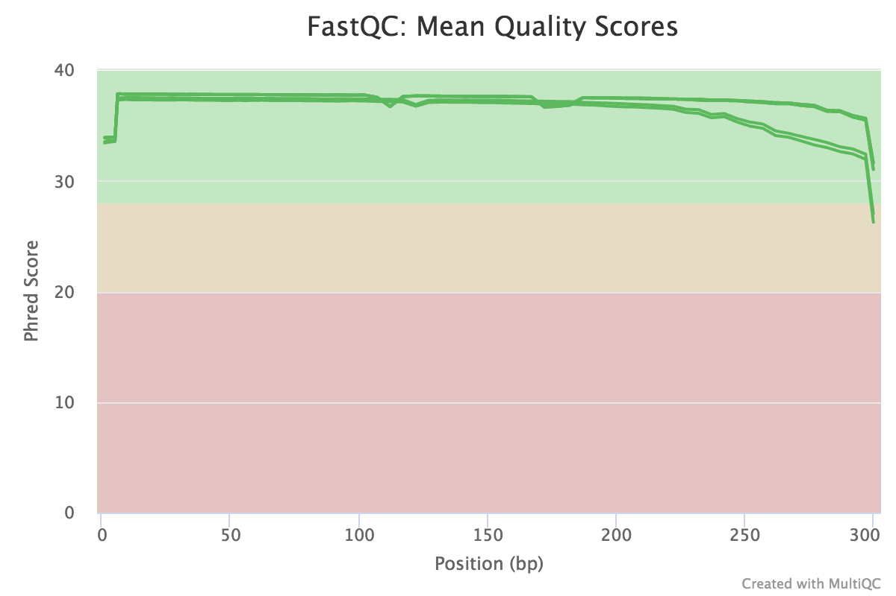
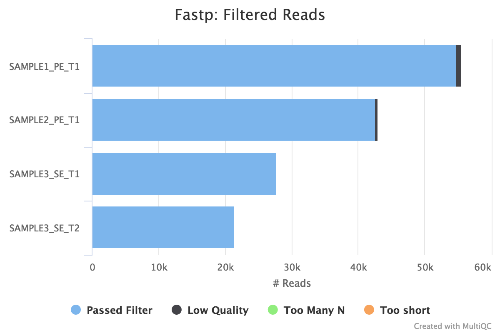
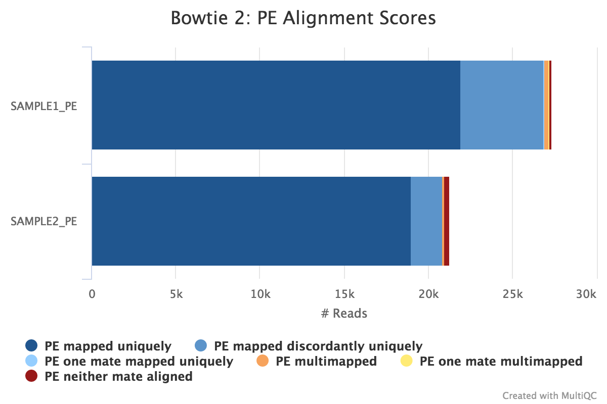
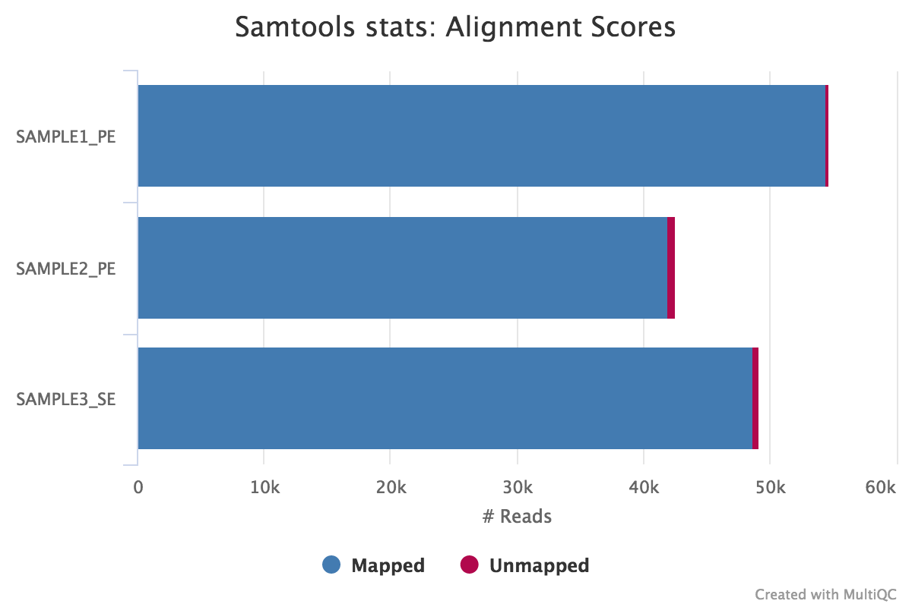
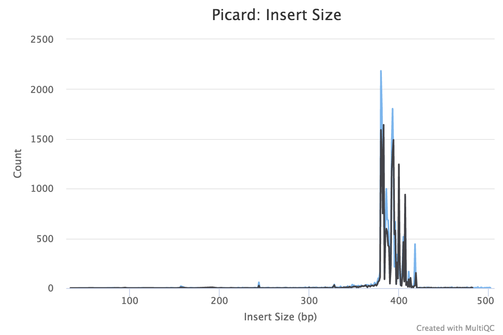

# nf-core/viralrecon: Output

This document describes the output produced by the pipeline. Most of the plots are taken from the MultiQC report, which summarises results at the end of the pipeline.

## Pipeline overview

The pipeline is built using [Nextflow](https://www.nextflow.io/)
and processes data using the following steps:

* [Preprocessing](#Preprocessing)
  * [parallel-fastq-dump](#parallel-fastq-dump) - Download samples from SRA
  * [FastQC](#fastqc) - Raw read QC
  * [fastp](#fastp) - Adapter and quality trimming
  * [cat](#cat) - Merge re-sequenced FastQ files
* [Variant calling](#variant-calling)
  * [Bowtie 2](#bowtie-2) - Read alignment relative to reference genome
  * [SAMtools](#samtools) - Sort, index and generate metrics for alignments
  * [iVar trim](#ivar=trim) - Primer sequence removal for amplicon data
  * [picard-tools](#picard-tools) - Whole genome coverage and alignment metrics
  * [VarScan 2, BCFTools, BEDTools](#varscan-2-bcftools-bedtools) - Option 1: Variant calling, consensus sequence generation and masking
  * [iVar variants and iVar consensus](#ivar-variants-and-ivar-consensus) - Option 2: Variant calling and consensus sequence generation
  * [SnpEff and SnpSift](#snpeff-and-snpsift) - Genetic variant annotation and functional effect prediction
  * [QUAST](#quast) - Consensus assessment report
* [De novo assembly](#de-novo-assembly)
  * [Cutadapt](#cutadapt) - Primer trimming for amplicon data
  * [Kraken2](#kraken2) - Removal of host reads
  * [SPAdes](#spades) - Option 1: Viral genome assembly
  * [metaSPAdes](#metaspades) - Option 2: Viral genome assembly
  * [Unicycler](#unicycler) - Option 3: Viral genome assembly
  * [BLAST](#blast) - Blast to reference assembly
  * [ABACAS](#abacas) - Order contigs according to reference genome
  * [PlasmidID](#plasmidid) - Assembly report and visualisation
  * [QUAST](#quast) - Assembly quality assessment
* [Workflow reporting and genomes](#workflow-reporting-and-genomes)
  * [MultiQC](#multiqc) - Present QC for raw reads, alignment, assembly and variant calling
  * [Reference genome files](#reference-genome-files) - Saving reference genome indices/files
  * [Pipeline information](#pipeline-information) - Report metrics generated during the workflow execution

## Preprocessing

### parallel-fastq-dump

TODO: Add some notes here about how we are downloading the data.

### FastQC

[FastQC](http://www.bioinformatics.babraham.ac.uk/projects/fastqc/) gives general quality metrics about your reads. It provides information about the quality score distribution across your reads, the per base sequence content (%T/A/G/C). You get information about adapter contamination and other overrepresented sequences.

For further reading and documentation see the [FastQC help](http://www.bioinformatics.babraham.ac.uk/projects/fastqc/Help/).

> **NB:** The FastQC plots displayed in the MultiQC report shows _untrimmed_ reads. They may contain adapter sequence and potentially regions with low quality. To see how your reads look after trimming, look at the FastQC reports in the `fastp` directory.

**Output directory: `preprocess/fastqc`**

* `<SAMPLE>_fastqc.html`: FastQC report, containing quality metrics for your untrimmed raw fastq files.
* `zips/<SAMPLE>_fastqc.zip`: Zip archive containing the FastQC report, tab-delimited data file and plot images.

### fastp

[fastp](https://github.com/OpenGene/fastp) is a tool designed to provide fast all-in-one preprocessing for FastQ files. It is developed in C++ with multithreading support to afford high performance. We use fastp for adapter trimming and quality filtering.

**Output directory: `preprocess/fastp`**

* `<SAMPLE>.trim.fastq.gz`: Paired trimmed reads. Only present if `--save_trimmed` parameter is supplied.
* `<SAMPLE>.trim.fail.gz`: Unpaired trimmed reads. Only present if `--save_trimmed` parameter is supplied.
* `<SAMPLE>.fastp.html`: fastp report in html format.
* `<SAMPLE>.fastp.json`: fastp report in json format.
* `fastqc/<SAMPLE>.trim.fastqc.html`: FastQC report of the trimmed reads.
* `fastqc/zips/<SAMPLE>.trim.fastqc.zip`: Zip archive containing the FastQC report.
* `log/<SAMPLE>.fastp.log`: Trimming log file.

### cat

**Output directory: `preprocess/merged_fastq`**

TODO: Add some notes here about why and how we are merging FastQ files from the same sample.

## Variant calling

### Bowtie 2

[Bowtie 2](http://bio-bwa.sourceforge.net/) is an ultrafast and memory-efficient tool for aligning sequencing reads to long reference sequences. Bowtie 2 supports gapped, local, and paired-end alignment modes.

**Output directory: `variants/bowtie2`**

* `<SAMPLE>.bam`: Original BAM file containing mapped reads. Only present if `--save_align_intermeds` parameter is supplied.
* `log/<SAMPLE>.log`: Bowtie2 mapping log file.
* `<SAMPLE>.sorted.bam`: Sorted aligned BAM file.
* `<SAMPLE>.sorted.bam.bai`: Index file for sorted aligned BAM file.

### SAMtools

The resulting BAM files are further processed with [SAMtools](http://samtools.sourceforge.net/) for co-ordinate sorting and indexing of the alignments. SAMtools is also used to generate read mapping statistics.

**Output directory: `variants/bowtie2/samtools_stats`**

* `<SAMPLE>.sorted.bam.flagstat`: Samtools flagstats mapping stats summary.
* `<SAMPLE>.sorted.bam.idxstats`: Samtools stats in the mapping index file.
* `<SAMPLE>.sorted.bam.stats`: Samtools mapping stats report.

### iVar trim

If `--protocol amplicon` is set then [iVar](http://gensoft.pasteur.fr/docs/ivar/1.0/manualpage.html) is used to trim the amplicon primer sequences from the reads. iVar uses the primer positions supplied in `--amplicon_bed` to soft clip primer sequences from an aligned and sorted BAM file.

**Output directory: `variants/ivar`**

* `<SAMPLE>.trim.sorted.bam`: Sorted aligned BAM file after trimming.
* `<SAMPLE>.trim.sorted.bam.bai`: Index file for sorted aligned trimmed BAM.
* `log/<SAMPLE>.trim.ivar.log`: iVar log file.
* `samtools_stats/<SAMPLE>.trim.sorted.bam.flagstat`: SAMtools flagstats summary file.
* `samtools_stats/<SAMPLE>.trim.sorted.bam.idxstats`: SAMtools stats in the mapping index file.
* `samtools_stats/<SAMPLE>.trim.sorted.bam.stats`: SAMtools mapping stats report.
* `<SAMPLE>.trim.stats`: Picard metrics summary file for evaluating coverage and performance.

### picard-tools

[picard-tools](https://broadinstitute.github.io/picard/index.html) is a set of command-line tools for manipulating high-throughput sequencing data. In this case we use it to obtain mapping and coverage metrics. If `--protocol amplicon` is set then these metrics will be obtained from the IVar trimmed alignments as opposed to the original Bowtie 2 alignments.

**Output directory: `variants/[bowtie2/iVar]/picard_metrics`**

* `<SAMPLE>.CollectWgsMetrics.coverage_metrics`: Picard metrics summary file for evaluating coverage and performance.
* `<SAMPLE>.CollectMultipleMetrics.alignment_summary_metrics`: Summary metrics of the alignment.
* `<SAMPLE>.CollectMultipleMetrics.base_distribution_by_cycle.pdf`: PDF file with the Base percentage plotted against the number of cycle.
* `<SAMPLE>.CollectMultipleMetrics.base_distribution_by_cycle_metrics`: Metrics file used to plot `<SAMPLE>.CollectMultipleMetrics.base_distribution_by_cycle.pdf`.
* `<SAMPLE>.CollectMultipleMetrics.insert_size_histogram.pdf`: PDF file with the counts and the cumulative fraction of reads that is higher than the insert size against the insert size.
* `<SAMPLE>.CollectMultipleMetrics.insert_size_metrics`: Metrics about the insert size distribution of a paired-end library used to plot `<SAMPLE>.CollectMultipleMetrics.insert_size_histogram.pdf`.
* `<SAMPLE>.CollectMultipleMetrics.quality_by_cycle.pdf`: PDF file with the Mean Quality against the cycle number.
* `<SAMPLE>.CollectMultipleMetrics.quality_by_cycle_metrics`: Metrics file used to plot `<SAMPLE>.CollectMultipleMetrics.quality_by_cycle.pdf`.
* `<SAMPLE>.CollectMultipleMetrics.quality_distribution.pdf`: PDF file with the distribution of quality scores.
* `<SAMPLE>.CollectMultipleMetrics.quality_distribution_metrics`: Metrics file used to plot `<SAMPLE>.CollectMultipleMetrics.quality_distribution.pdf`.

Picard documentation: [Picard docs](https://broadinstitute.github.io/picard/command-line-overview.html)

### VarScan 2, BCFTools, BEDTools

First of all SAMtools is used to generate the variant calling VCF file. Then [VarScan 2](http://varscan.sourceforge.net/) is used to call for major and low frequency variants. VarScan is a platform-independent software tool developed at the Genome Institute at Washington University to detect variants in NGS data.

[Bcftools](http://samtools.github.io/bcftools/bcftools.html) is a set of utilities that manipulate variant calls in the Variant Call Format (VCF) and its binary counterpart BCF. The resulting variant calling vcf for haploid genomes is indexed and then the consensus genome is created adding the variants to the reference viral genome. This consensus genome was obtained using the predominant variants (majority) of the mapping file.

[Bedtools](https://bedtools.readthedocs.io/en/latest/) are a swiss-army knife of tools for a wide-range of genomics analysis tasks. In this case we use:

1. bedtools genomecov computes histograms (default), per-base reports (-d) and BEDGRAPH (-bg) summaries of feature coverage (e.g., aligned sequences) for a given genome.
2. bedtools maskfasta masks sequences in a FASTA file based on intervals defined in a feature file. This may be useful fro creating your own masked genome file based on custom annotations or for masking all but your target regions when aligning sequence data from a targeted capture experiment.

**Output directory: `variants/varscan2`**

* `<SAMPLE>.pileup`
  * If `--save_pileup`. Samtools pileup file. The pileup file summarizes all data from the reads at each genomic region that is covered by at least one read. Each row of the pileup file gives similar information to a single vertical column of reads in the IGV view.
* `<SAMPLE>.highfreq.vcf.gz`
  * High frequency variants VCF file.
* `<SAMPLE>.highfreq.vcf.gz.tbi`
  * High frequency variants VCF index file.
* `<SAMPLE>.lowfreq.vcf.gz`
  * Low frequency variants VCF file.
* `<SAMPLE>.lowfreq.vcf.gz.tbi`
  * Low frequency variants VCF index file.
* `log/<SAMPLE>.highfreq.varscan2.log`
  * VarScan2 high frequency variants log file.
* `log/<SAMPLE>.lowfreq.varscan2.log`
  * VarScan2 low frequency variants log file.

**Output directory: `variants/bcftools`**

* `<SAMPLE>.consensus.fa`
  * Consensus viral genome file generated from adding the variants called before to the viral reference genome. These variants are only the majoritarian variants, including only SNPs and small indels.

  **Output directory: `variants/bcftools`**

  * `<SAMPLE>.consensus.masked.fa`
    * Masked consensus fasta file.

### iVar variants and iVar consensus

iVar can also use the output of the samtools mpileup command to call variants - single nucleotide variants(SNVs) and indels.

**Output directory: `variants/ivar/variants`**

* `<SAMPLE>.tsv`
  * TAB separated file with the variants.

Finally, iVar generates a consensus genome with the variants:

**Output directory: `variants/ivar/consensus`**

* `<SAMPLE>.consensus.fa`
  * Fasta file with thte consensus gneome.
* `<SAMPLE>.consensus.qual.txt`
  * TXT file with the average quality of each base in the consensus sequence.

### SnpEff and SnpSift

[SnpEff](http://snpeff.sourceforge.net/SnpEff.html) is a genetic variant annotation and functional effect prediction toolbox. It annotates and predicts the effects of genetic variants on genes and proteins (such as amino acid changes).

[SnpSift](http://snpeff.sourceforge.net/SnpSift.html) annotates genomic variants using databases, filters, and manipulates genomic annotated variants. Once you annotated your files using SnpEff, you can use SnpSift to help you filter large genomic datasets in order to find the most significant variants for your experiment.

**Output directory: `variants/varscan2/snpeff`**

* `<SAMPLE>.lowfreq.snpEff.csv`
  * Low frequency variants annotation csv file.
* `<SAMPLE>.lowfreq.snpSift.table.txt`
  * Low frequency variants SnpSift summary table.
* `<SAMPLE>.lowfreq.snpEff.vcf.gz`
  * Low frequency variants annotated VCF table.
* `<SAMPLE>.lowfreq.snpEff.genes.txt`
  * Low frequency variants genes table.
* `<SAMPLE>.lowfreq.snpEff.summary.html`
  * Low frequency variants summary html file.
* `<SAMPLE>.highfreq.snpEff.csv`
  * High frequency variants annotation csv file.
* `<SAMPLE>.highfreq.snpSift.table.txt`
  * High frequency variants SnpSift summary table.
* `<SAMPLE>.highfreq.snpEff.vcf.gz`
  * High frequency variants annotated VCF table.
* `<SAMPLE>.highfreq.snpEff.genes.txt`
  * High frequency variants genes table.
* `<SAMPLE>.highfreq.snpEff.summary.html`
  * High frequency variants summary html file.

### QUAST

TODO: Add description of what QUAST is doing here

## De novo assembly

We selected the reads that didn't cluster using kraken2 with the host genome and assembled them to create a viral genome assembly.

### Cutadapt

Only when running `--protocol amplicon`, [Cutadapt](https://cutadapt.readthedocs.io/en/stable/guide.html) is used for clipping primer sequences from reads prior to assembly.

**Output directory:** `assembly/cutadapt`

* `fastqc/<SAMPLE>.ptrim_fastqc.html`
  * Fastqc HTML reports for primer clipped reads.
* `fastqc/zips/<SAMPLE>.ptrim_fastqc.zip`
  * Fastqc HTML reports for primer clipped reads.
* `log/<SAMPLE>.cutadapt.log`
  * Cutadapt logs.
* `<SAMPLE>.ptrim.fastq.gz`
  * Only if `--save_trimmed`. Fastq files with primer sequences trimmed.

### Kraken2

[Kraken2](https://ccb.jhu.edu/software/kraken2/index.shtml?t=manual) is a taxonomic sequence classifier that assigns taxonomic labels to DNA sequences. Kraken examines the k-mers within a query sequence and uses the information within those k-mers to query a database. That database maps k-mers to the lowest common ancestor (LCA) of all genomes known to contain a given k-mer.

We mapped the fastq file against the reference host genome.

**Output directory: `assembly/kraken2`**

* `<SAMPLE>.host.fastq.gz`
  * Only with `--save_kraken2_fastq`. Reads that mapped with host taxon.
* `<SAMPLE>.viral.fastq.gz`
  * Only with `--save_kraken2_fastq`. Reads that mapped with viral taxon.
* `<SAMPLE>.kraken2.report.txt`
  * Kraken taxonomic report. The report contains one line per taxonomic classification nd the following columns:
    1. Percentage of fragments covered by the clade rooted at this taxon
    2. Number of fragments covered by the clade rooted at this taxon
    3. Number of fragments assigned directly to this taxon
    4. A rank code, indicating (U)nclassified, (R)oot, (D)omain, (K)ingdom, (P)hylum, (C)lass, (O)rder, (F)amily, (G)enus, or (S)pecies. Taxa that are not at any of these 10 ranks have a rank code that is formed by using the rank code of the closest ancestor rank with a number indicating the distance from that rank.  E.g., "G2" is a rank code indicating a taxon is between genus and species and the grandparent taxon is at the genus rank.
    5. NCBI taxonomic ID number
    6. Indented scientific name

### SPAdes

[SPAdes](https://kbase.us/applist/apps/kb_SPAdes/run_SPAdes/release?gclid=Cj0KCQiAt_PuBRDcARIsAMNlBdroQS7y2hPFuhagq1QPvQ39FcvGxbhtZwhn8YbxIB4LrGIHKjJ-iPwaAn_lEALw_wcB) is a de Bruijn graph-based assembler. We selected the reads that didn't mapped with the host genome and assembled them using SPAdes to create a viral genome assembly.

**Output directory:** `assembly/spades`

* `<SAMPLE>.scaffolds.fasta`
  * SPAdes sssembled scaffolds.

### metaSPAdes

[metaSPAdes](https://kbase.us/applist/apps/kb_SPAdes/run_SPAdes/release?gclid=Cj0KCQiAt_PuBRDcARIsAMNlBdroQS7y2hPFuhagq1QPvQ39FcvGxbhtZwhn8YbxIB4LrGIHKjJ-iPwaAn_lEALw_wcB) is a de Bruijn graph-based assembler, with the option `--meta` the assembler works for metagenomics date trying to reconstruct different genomes.

**Output directory: `assembly/metaspades`**

* `<SAMPLE>.meta.scaffolds.fasta`
  * MetaSPaded assembled scaffolds.

### Unicycler

[Unicycler](https://github.com/rrwick/Unicycler) is an assembly pipeline that works as a spades optimizer.

**Output directory: `assembly/unicycler`**

* `<SAMPLE>.assembly.fasta`
  * Assembled scaffolds.

### BLAST

[NCBI Blast](https://blast.ncbi.nlm.nih.gov/Blast.cgi) is used for aligning the contigs against the reference virus genome.

**Output directory: `assembly/<ASSEMBLER>/blast`**

* `<SAMPLE>.blast.txt`
  * Blast results against the target virus.
* `<SAMPLE>.blast.filt.header.txt`
  * Filtered Blast results.

### ABACAS

[Abacas](abacas.sourceforge.ne) intended to rapidly contiguate (align, order, orientate), visualize and design primers to close gaps on shotgun assembled contigs based on a reference sequence.

**Output directory: `assembly/<ASSEMBLER>/abacas`**

* `<SAMPLE>`
  * `<SAMPLE>_abacas.fasta`: Ordered and orientated sequence file.
  * `<SAMPLE>_abacas.tab`: Feature file.
  * `<SAMPLE>_abacas.bin`: Bin file that contains contigs that are not used in ordering.
  * `<SAMPLE>_abacas.crunch`: Comparison file.
  * `<SAMPLE>_abacas.gaps`: Gap information.
  * `unused_contigs.out`: Information on contigs that have a mapping information but could not be used in the ordering.
  * `<SAMPLE>_abacas.MULTIFASTA.fa`: A list of ordered and orientated contigs in a multi-fasta format.

### PlasmidID

[PlasmidID](https://github.com/BU-ISCIII/plasmidID) was used to graphically represent the alignment of the reference genome with the assembly obtained with SPAdes. This helps to visualize the coverage of the reference genome in the assembly. To find more information about the output files go to the [plasmidID documentation](https://github.com/BU-ISCIII/plasmidID/wiki/Understanding-the-image:-track-by-track)

**Output directory: `assembly/<ASSEMBLER>/plasmidid**

* `<SAMPLE>/images/<SAMPLE>_<REF_VIR_NAME>.png`
  * PNG file with the visualization of the alignment between the assembled viral genome and the reference viral genome.
* `<SAMPLE>/data/`
  * Files used for drawing the circos images.
* `<SAMPLE>/database`
  * Annotation files used for drawing the circos images.

### QUAST

[QUAST](http://bioinf.spbau.ru/quast) evaluates genome assemblies. We compared the reference genome with the contigs and scaffold assemblies. The HTML results can be opened with any browser (we recommend using Google Chrome). We have a quast folder for each assembler selected.

**Output directory: `assembly/<ASSEMBLER>/quast`**

* `report.html`
  * Compressed format of the indexed variants file.
  * The meaning of the different metrics:
    * Contigs (≥ x bp): is total number of contigs of length ≥ x bp.
    * Total length (≥ x bp): is the total number of bases in contigs of length ≥ x bp.
    * Contigs: is the total number of contigs in the assembly.
    * Largest contig: is the length of the longest contig in the assembly.
    * Total length: is the total number of bases in the assembly.
    * Reference length: is the total number of bases in the reference genome.
    * GC (%): is the total number of G and C nucleotides in the assembly, divided by the total length of the assembly.
    * Reference GC (%): is the percentage of G and C nucleotides in the reference genome.
    * N50: is the length for which the collection of all contigs of that length or longer covers at least half an assembly.
    * NG50: is the length for which the collection of all contigs of that length or longer covers at least half the reference genome. This metric is computed only if the reference genome is provided.
    * N75 and NG75: are defined similarly to N50 but with 75 % instead of 50 %.
    * L50 (L75, LG50, LG75) is the number of contigs equal to or longer than N50 (N75, NG50, NG75). In other words, L50, for example, is the minimal number of contigs that cover half the assembly.

## Workflow reporting and genomes

### MultiQC

[MultiQC](http://multiqc.info) is a visualization tool that generates a single HTML report summarizing all samples in your project. Most of the pipeline QC results are visualised in the report and further statistics are available in within the report data directory.

The pipeline has special steps which allow the software versions used to be reported in the MultiQC output for future traceability.

**Output directory: `results/multiqc`**

* `Project_multiqc_report.html`
  * MultiQC report - a standalone HTML file that can be viewed in your web browser
* `Project_multiqc_data/`
  * Directory containing parsed statistics from the different tools used in the pipeline

For more information about how to use MultiQC reports, see [http://multiqc.info](http://multiqc.info)

### Reference genome files

*Documentation*:  
[Bowtie2](http://bowtie-bio.sourceforge.net/bowtie2/index.shtml), [`Kraken2`](http://ccb.jhu.edu/software/kraken2/), [`blastn`](https://blast.ncbi.nlm.nih.gov/Blast.cgi?PAGE_TYPE=BlastSearch)

*Description*:
Reference genome-specific files can be useful to keep for the downstream processing of the results.

*Output directories*:

* `genome/`  
  A number of genome-specific files are generated by the pipeline in order to aid in the filtering of the data, and because they are required by standard tools such as BEDTools. These can be found in this directory along with the genome fasta file which is required by IGV. If using a genome from AWS iGenomes and if it exists a `README.txt` file containing information about the annotation version will also be saved in this directory.  
* `genome/Bowtie2Index/`  
  If the `--save_reference` parameter is provided then the alignment indices generated by the pipeline will be saved in this directory. This can be quite a time-consuming process so it permits their reuse for future runs of the pipeline or for other purposes.  
* `genome/BlastDB/`  
  If the `--save_reference` parameter is provided then the alignment indices generated by the pipeline will be saved in this directory. This can be quite a time-consuming process so it permits their reuse for future runs of the pipeline or for other purposes.  
* `genome/kraken2_<kraken2_db_name>/`  
  If the `--save_reference` parameter is provided then the alignment indices generated by the pipeline will be saved in this directory. This can be quite a time-consuming process so it permits their reuse for future runs of the pipeline or for other purposes.  

### Pipeline information

*Documentation*:  
[Nextflow!](https://www.nextflow.io/docs/latest/tracing.html)

*Description*:  
Nextflow provides excellent functionality for generating various reports relevant to the running and execution of the pipeline. This will allow you to trouble-shoot errors with the running of the pipeline, and also provide you with other information such as launch commands, run times and resource usage.

*Output directories*:

* `pipeline_info/`  
  * Reports generated by the pipeline - `pipeline_report.html`, `pipeline_report.txt` and `software_versions.csv`.
  * Reports generated by Nextflow - `execution_report.html`, `execution_timeline.html`, `execution_trace.txt` and `pipeline_dag.svg`.
  * Reformatted samplesheet files used as input to the pipeline - `samplesheet.pass.csv`.
* `Documentation/`  
  * Documentation for interpretation of results in HTML format - `results_description.html`.
